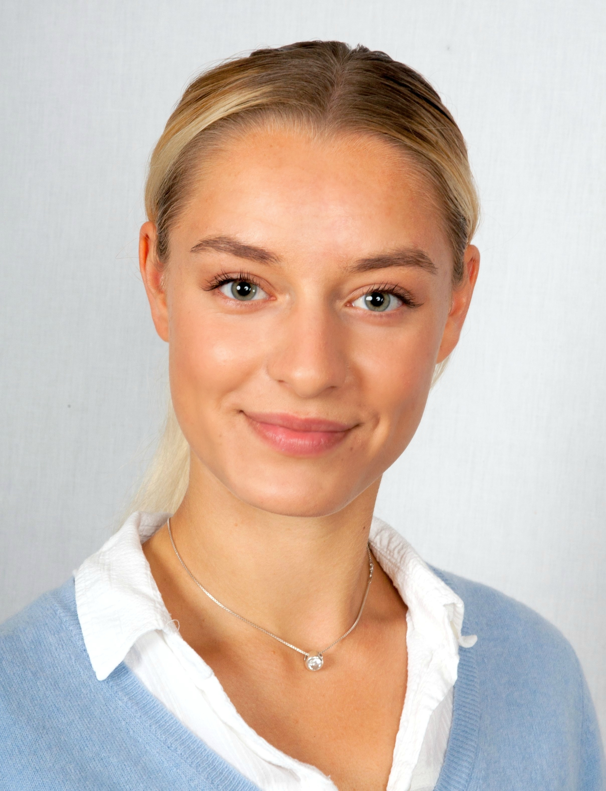

---

name: Annika Mordelt
position: Master's Honours student

---

{:class="img-responsive" width="30%" height="30%"}{: .align-left}

Annika obtained a Masters’ degree in Neuroscience at the Donders Institute in Nijmegen, where she focused on modelling neurodevelopmental disorders with iPSCs. She joined the Leigh Lab as a Master's Honours student. Next to science she likes spending time in nature, playing volleyball, and board games.

