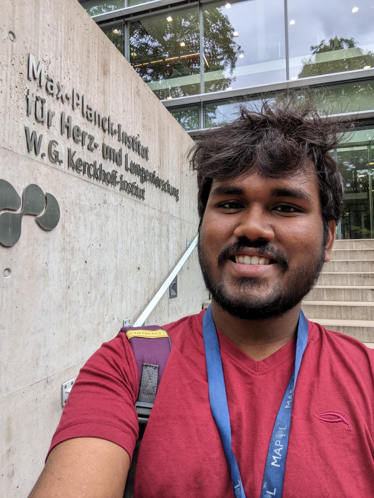

---

name: Dhanuush Balakannan
position: Master's Student

---

{:class="img-responsive" width="30%" height="30%"}{: .align-left}

Dhanuush (he/him) is a final year integrated master's student from IISER Mohali, India. He joined the Leigh Lab as a visiting student to do his Master's thesis. His academic interests are to understand unique characteristics of regenerating species from an evolutionary point of view. Recently he developed interests in cancer models. In the lab, he is trying to understand the  mechanisms of tumor resistance in salamanders with high regenerative abilities. He is also interested in science communication, trying to take Science to doorsteps of general public. Dhanuush is enthusiastic about different cultures and traditions. He likes traveling and documenting his memories through photographs!

