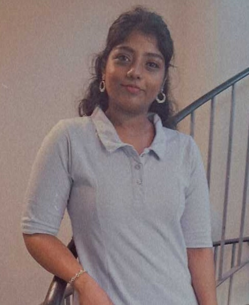

---

name: Dharshana Dhanasekar
position: Intern

---

{:class="img-responsive" width="30%" height="30%"}{: .align-left}

Dharshana came to Lund to pursue her Master’s program in Molecular Biology, specializing in Immunology and Infection Biology. She joined the Regenerative Immunology Lab, where she studies patterning genes in salamanders to better understand the mechanisms of limb regeneration. In her free time, she enjoys cooking, playing badminton, and practicing classical dance.

