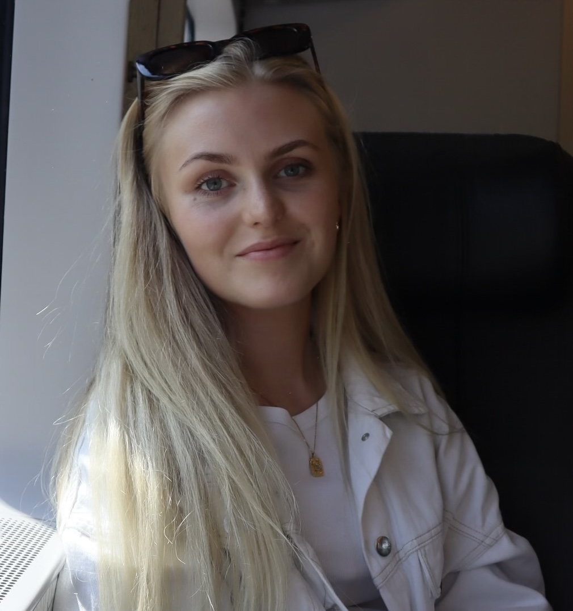

---

name: Disa Stephensen
position: Master's Student

---

{:class="img-responsive" width="30%" height="30%"}{: .align-left}

Disa is doing her Master’s thesis on the role of innate immunity in the regenerative ability of newts. She studied her Bachelor’s and now Master’s in Molecular Biology at Lund University. Outside of the lab, she enjoys running, going to the gym, knitting, and spending time with family and friends.

