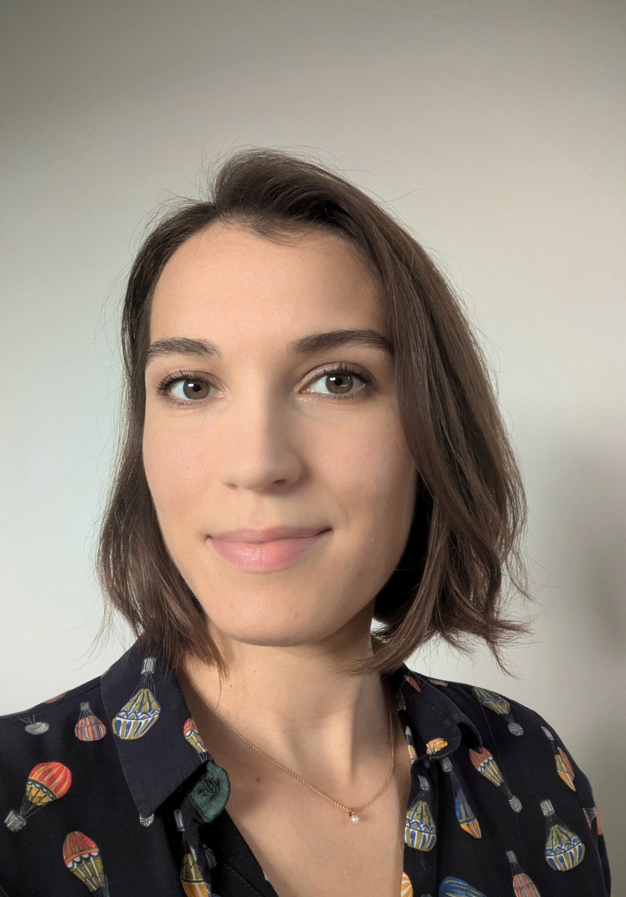

---

name: Elsa Görsch
position: Postdoctoral Fellow

---

{:class="img-responsive" width="30%" height="30%"}{: .align-left}

Elsa joined the lab in 2024 after completing her PhD studies in biomedical research at the University of Basel. With a background in biochemistry and leukemia research, she joined the lab to study cancer resistance mechanisms in the salamander model. She is particularly fascinated by the regulation of cell fate plasticity in salamanders, allowing them to regenerate complex tissues without predisposing them to tumor formation. Beyond science, Elsa loves painting and enjoys reading and yoga.

