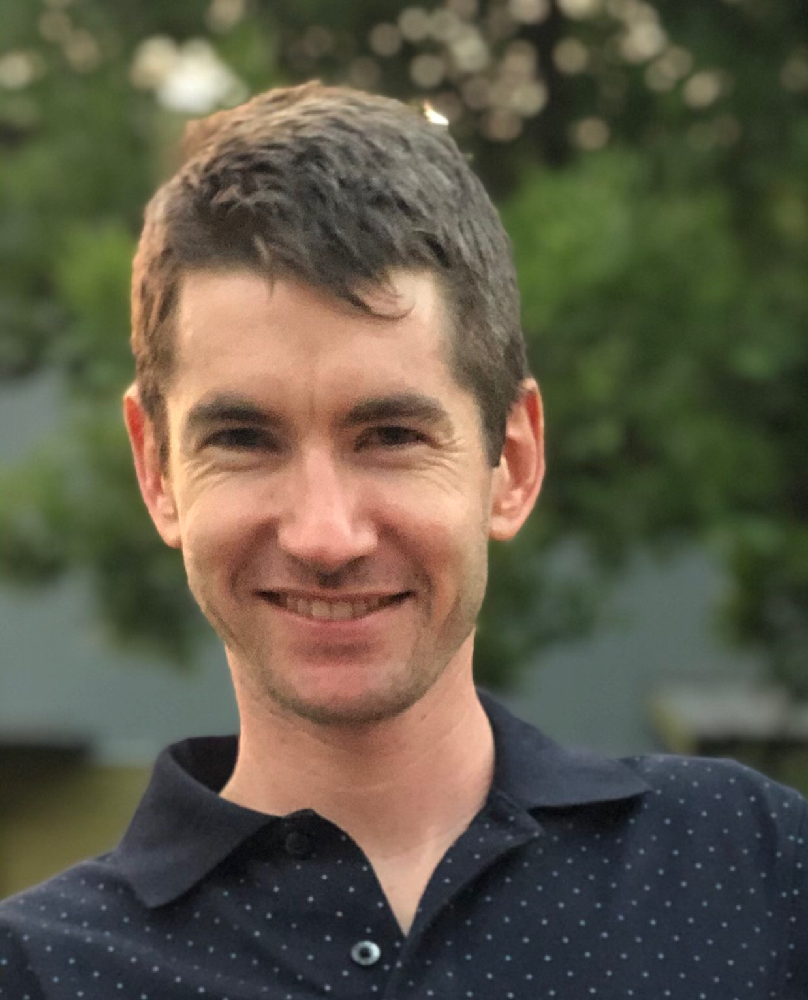

---

name: Joe Cardiello
position: Postdoctoral Fellow

---

{:class="img-responsive" width="30%" height="30%"}{: .align-left}

Joe started his postdoc for the Leigh lab after moving to Lund from the University of Colorado at Boulder. He conducted his PhD and a first postdoctoral position there in the departments of Biochemistry, and the BioFrontiers Institute focusing on using genomic approaches to study transcription regulation and molecular responses to cell stresses. Outside of science, Joe likes to go hiking/camping, mountain biking, skiing, playing ultimate frisbee, and eating ice cream.

