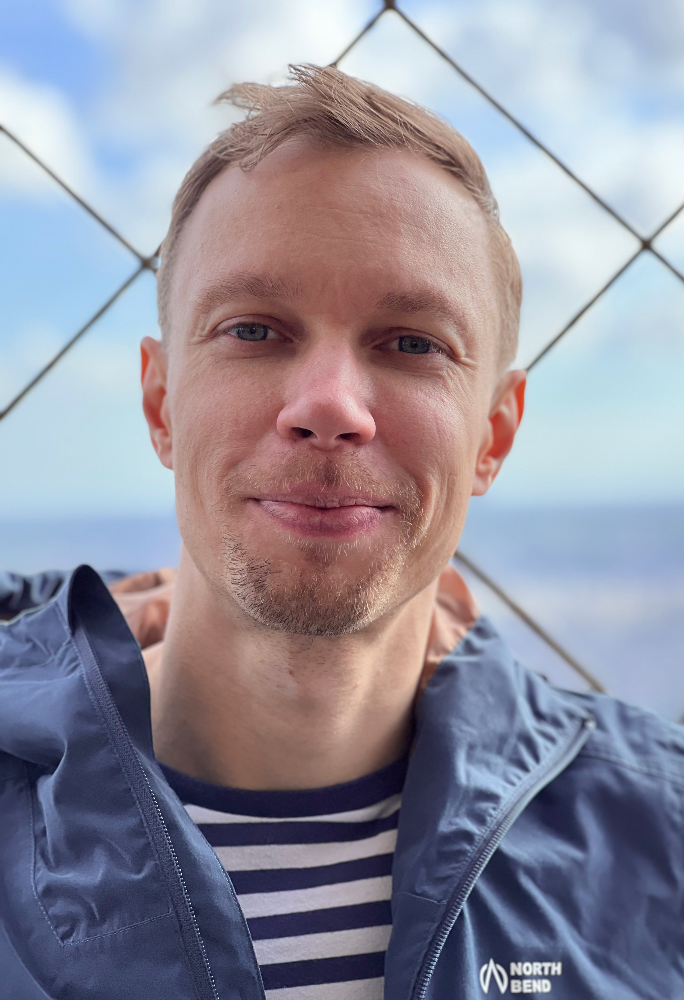

---

name: Lennart Rikk
position: Master's Student

---

{:class="img-responsive" width="30%" height="30%"}{: .align-left}

 Lennart was working as a designer before kick-starting his academic journey at the University of Tartu in Estonia, where he earned his Bachelor's degree in Genetic Engineering. He now studies Molecular Biology for his Master's at Lund University, working on his thesis project in our lab.His research interests are in regeneration and mechanisms of aging. On sunny days, he enjoys wakeboarding and hiking.

