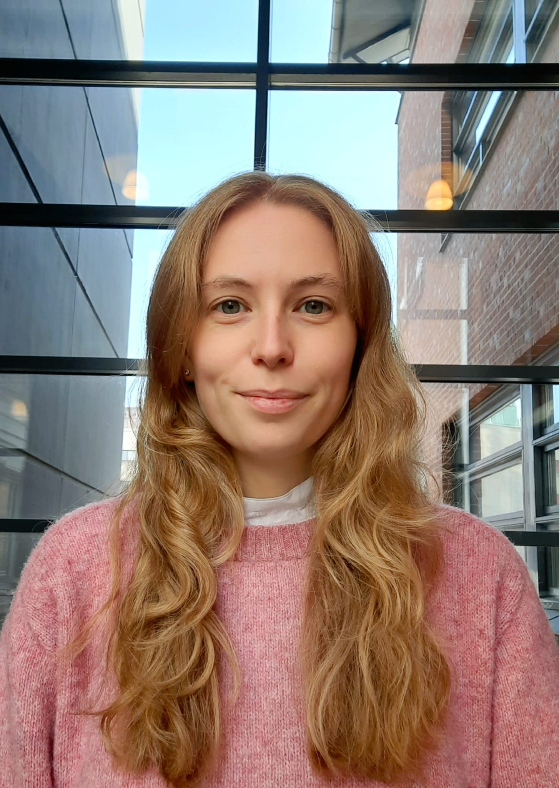

---

name: Marlene Oesterle
position: PhD Student

---

{:class="img-responsive" width="30%" height="30%"}{: .align-left}

Marlene earned her Bachelor's in Biochemistry and Master's in Molecular Medicine before igniting her interest in salamanders and regeneration during an IMP internship in Vienna. She's now pursuing a PhD in the field. Beyond science, Marlene enjoys tennis, snowboarding, reading, and exploring new places through travel.

