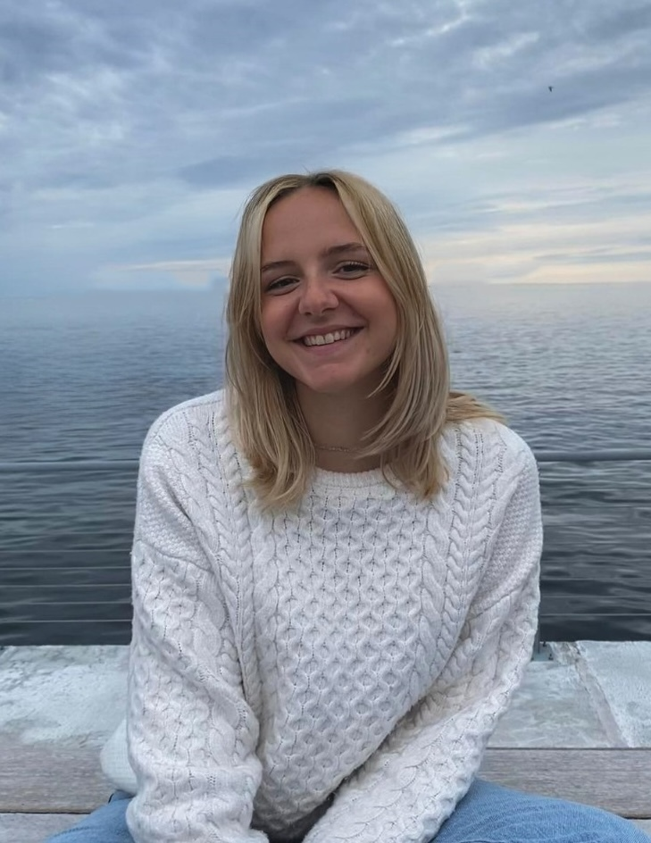

---

name: Milica Dimitrijevic
position: Master's Student

---

{:class="img-responsive" width="30%" height="30%"}{: .align-left}

Milica moved to Sweden to pursue a Master’s program in Molecular Biology at Lund University after completing her undergraduate studies at the University of Belgrade, Serbia. She joined our lab for her thesis project, collaborating with the Douse lab to study transposable elements in salamanders. Through this project, she deepened her interest for genomics and transposon biology, particularly in large genomes like those found in salamanders. Outside of science, Milica enjoys trying out different sports, reading and traveling!

