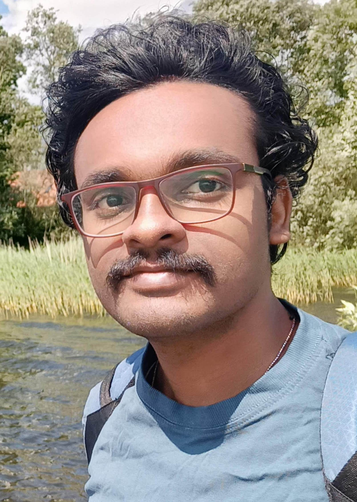

---

name: Nikhilesh Vasanthakumar
position: Master's student

---

{:class="img-responsive" width="30%" height="30%"}{: .align-left}

Nikhilesh is doing his Master's in Bioinformatics in the lab. He did my Bachelor's in Biotechnology where he worked with proteomics and structure prediction. After starting his master's he took an interest in Systems Immunology and analysing large datasets. He like to learn new languages, currently he know English, Hindi, Telugu, and Tamil. He is currently learning Swedish and German. In his free time he likes to read books and play chess competitively.

