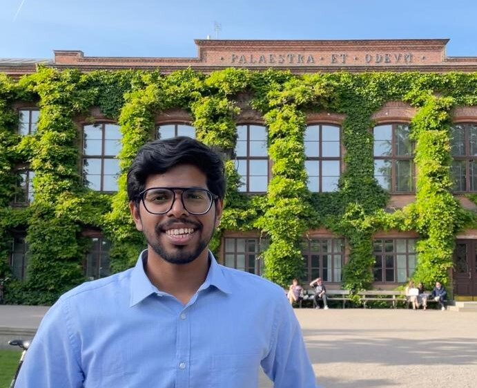

---

name: Rohit Sivaprasad
position: Master's student

---

{:class="img-responsive" width="30%" height="30%"}{: .align-left}

Rohit is a Master student at Lund University performing his thesis with the Leigh Lab. He did his bachelors in India in Biotechnology and now he plans to investigate the role of tumour suppressors in our salamanders through CRISPR Knockouts. On the weekends, he like's to take things slow, watch animes and movies, cook meals with his friends, and occasionally travel.

