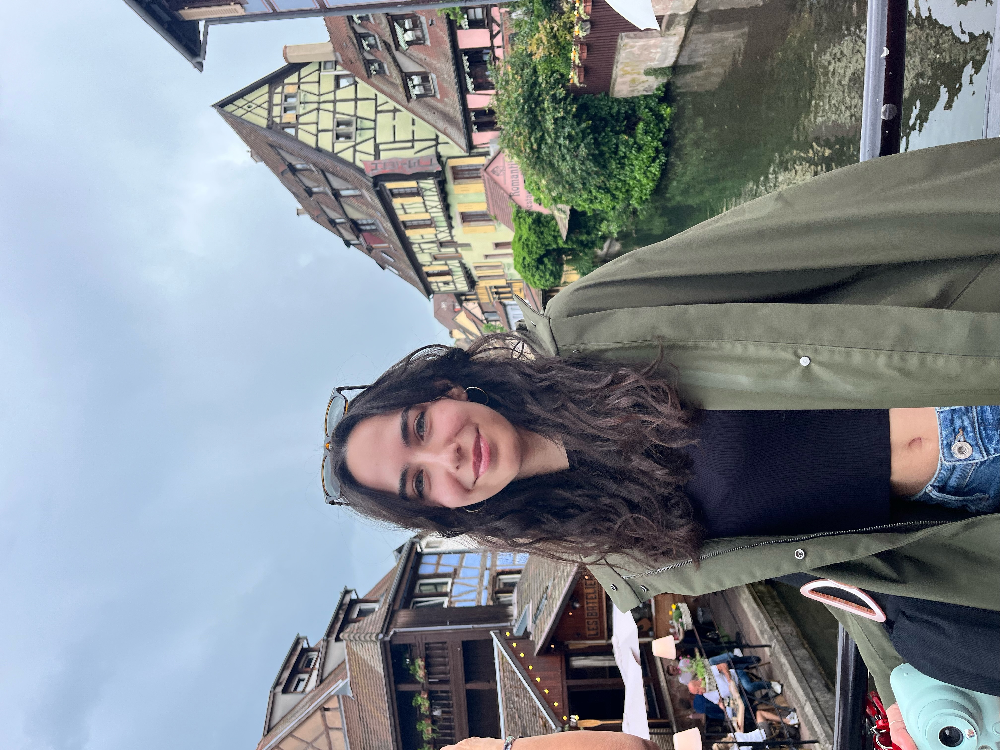

---

name: Selin Yalman
position: Master's Student

---

{:class="img-responsive" width="30%" height="30%"}{: .align-left}

Selin earned her Bachelor’s degree in Molecular Biology and Genetics at Bilkent University before starting her Master’s in Molecular Medicine at Radboud University. She joined the Leigh Lab as a visiting student for her second Master’s research internship. Her research interests include stem cells, immunology, and genetics. In her free time she enjoys baking, reading, going on walks, and traveling.

