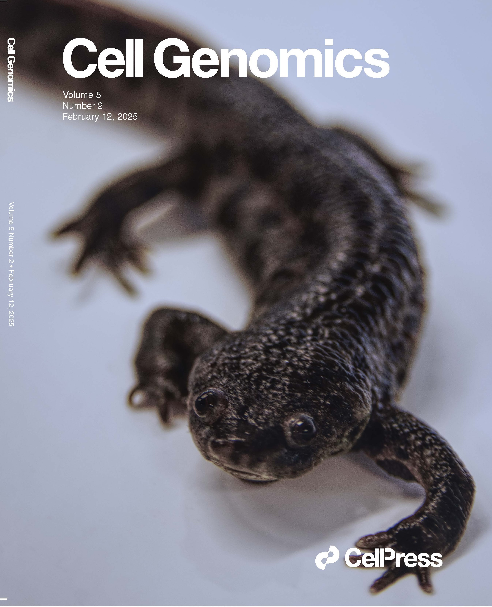

Here you will find our publications and accompanying resources. For a full list of Nick's work check out [Google Scholar](https://scholar.google.com/citations?user=iSy-Wy4AAAAJ&hl=en) 

## Publications:

{: .align-left}

<figure class="align-right">
  
</figure>

    Brown T&#42;, Mishra K&#42;, Elewa A&#42;, Iarovenko S&#42;, Subramanian E, Joven Araus A, Petzold A, Fromm B, Friedländer MR, Rikk L, Suzuki M, Suzuki KT, Hayashi T, Toyoda A, Oliveira CR, Osipova E, Leigh ND✉️ ,Yun MH✉️, Simon A✉️. <a href="https://www.life-science-alliance.org/content/6/8/e202301979">Chromosome-scale genome assembly reveals how repeat elements shape non-coding RNA landscapes active during newt limb regeneration</a>. Cell Genomics. 27 January 2025.✉️  co-corresponding/last author, &#42; co-first author

 
 
 
 
 

{: .align-left}

    Brown T&#42;, Mishra K&#42;, Elewa A&#42;, Iarovenko S&#42;, Subramanian E, Joven Araus A, Petzold A, Fromm B, Friedländer MR, Rikk L, Suzuki M, Suzuki KT, Hayashi T, Toyoda A, Oliveira CR, Osipova E, Leigh ND✉️ ,Yun MH✉️, Simon A✉️. <a href="https://www.life-science-alliance.org/content/6/8/e202301979">Chromosome-scale genome assembly reveals how repeat elements shape non-coding RNA landscapes active during newt limb regeneration</a>. Cell Genomics. 27 January 2025.✉️  co-corresponding/last author, &#42; co-first author 

Check out a thread on this paper [here](https://bsky.app/profile/niche-leigh.bsky.social/post/3li33wwysek2a)
 
 
 
 
 
 
 
 

{: .align-left}
Cardiello JF, Araus AJ, Giatrellis S, Simon A, Leigh ND. [Evaluation of genetic demultiplexing of single-cell sequencing data from model species](https://www.life-science-alliance.org/content/6/8/e202301979). Life Science Alliance. 17 May 2023. 
 
 
 
 
 

{: .align-left}
Leigh ND, Currie JD. [Rebuilding limbs, one cell at a time.](https://anatomypubs.onlinelibrary.wiley.com/doi/full/10.1002/dvdy.463?af=R) Developmental Dynamics. 16 February 2022.  
 
 
 
 
 

{: .align-left}
Stegmayr J, Alsafadi HN, Langwinski W, Niroomand A, Lindstedt S, Leigh ND, Wagner DE. [Isolation of high yield and quality RNA from human precision-cut lung slices for RNA-sequencing and computational integration with larger patient cohorts.](https://journals.physiology.org/doi/pdf/10.1152/ajplung.00401.2020) AJP Lung and Cellular and Molecular Physiology. 28 Oct 2020. 
 
 
 

{: .align-left}
Leigh ND, Sessa S., Dragalzew AC, Payzin-Dogru D, Sousa JF, Aggouras AN, Johnson K, Dunlap GS, Haas BJ, Levin M, Schneider I, Whited JL. [von Willebrand factor D and EGF domains is an evolutionarily conserved and required feature of blastemas capable of multitissue appendage regeneration.](https://onlinelibrary.wiley.com/doi/abs/10.1111/ede.12332) Evolution & Development. 2020; 1– 15.
 
 
 

{: .align-left}
Leigh ND, Dunlap GS, Johnson K, Mariano R, Oshiro R, Wong AY, Bryant DM, Miller BM, Ratner A, Chen A, Ye WW, Haas BJ, Whited JL. [Transcriptomic landscape of the blastema niche in regenerating adult axolotl limbs at single-cell resolution.](https://www.nature.com/articles/s41467-018-07604-0) Nature Communications 2018 9; 5153.

## Pre-prints:
 

{: .align-left}
Brown T&#42;, Elewa A&#42;, Iarovenko S&#42;, Subramanian E&#42;, Araus AJ, Petzold A, Suzuki M, Suzuki KT, Hayashi T, Toyoda A, Oliveira C, Osipova E, Leigh ND✉️ , Simon A✉️ , Yun MH✉️ . [Sequencing and chromosome-scale assembly of the giant Pleurodeles waltl genome](https://www.biorxiv.org/content/10.1101/2022.10.19.512763v1.full) bioRxiv October 22, 2022.✉️  co-corresponding/last author, &#42; co-first author
 
 
 

{: .align-left}
Cardiello JF, Araus AJ, Giatrellis S, Simon A, Leigh ND. [Accurate genotype-based demultiplexing of single cell RNA sequencing samples from non-human animals.](https://www.biorxiv.org/content/10.1101/2022.09.22.508993v1) bioRxiv Septermber 23, 2022.
 
 
 

{: .align-left}
Stegmayr J, Alsafadi HN, Langwinski W, Niroomand A, Lindstedt S, Leigh ND, Wagner DE. [Isolation of high yield and quality RNA from human precision-cut lung slices for RNA-sequencing and computational integration with larger patient cohorts.](https://www.biorxiv.org/content/10.1101/2020.08.21.254516v1) bioRxiv August 22, 2020.
 
 
 

{: .align-left}
Leigh ND, Sessa S., Dragalzew AC, Payzin-Dogru D, Sousa JF, Aggouras AN, Johnson K, Dunlap GS, Haas BJ, Levin M, Schneider I, Whited JL. [von Willebrand factor D and EGF domains is an evolutionarily conserved and required feature of blastemas capable of multitissue appendage regeneration.](https://www.biorxiv.org/content/10.1101/842948v2.full) bioRxiv November 15, 2019.

